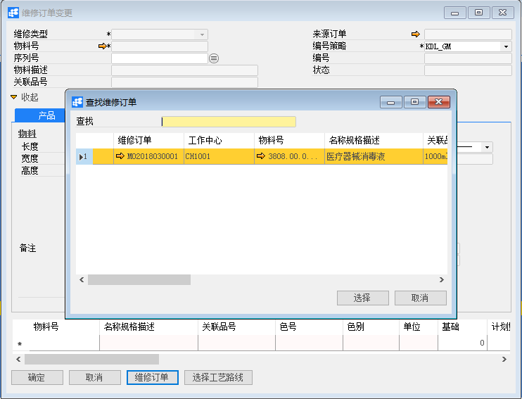
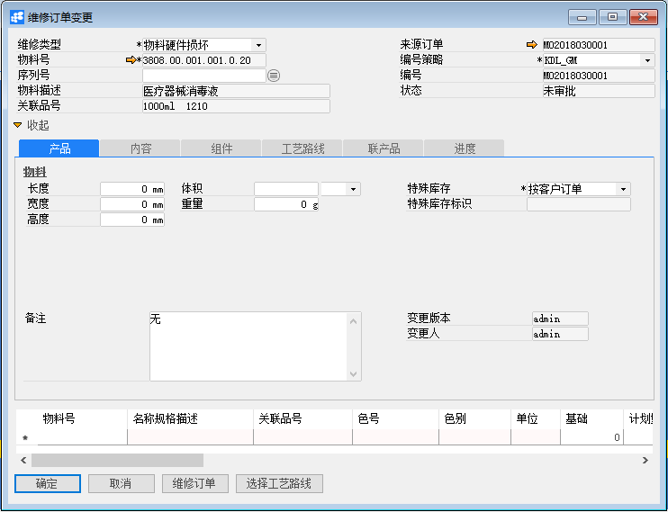
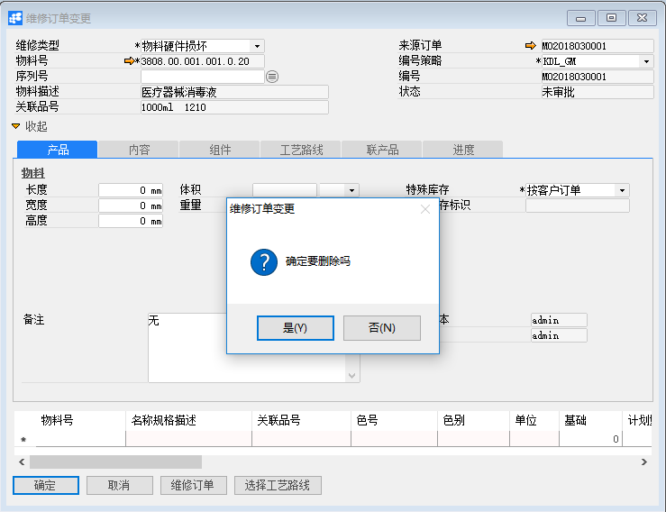

# 维修订单变更

## 功能解释

BAP维修订单变更为了更改已下达状态的维修订单信息。

## 文章主旨

本文介绍如何通过BAP Nicer 5完成维修订单变更的新增、修改及删除操作。

## 操作要求

当前登陆用户拥有操作维修订单变更业务的权限，权限设置请在帮助文档中搜索查看。

## 新增维修订单变更

1. 从菜单栏【模块】->【服务】->【维修订单变更】,打开维修订单变更窗口；

2. 点击【维修订单】按钮，选择要修改的维修订单，点击【选择】按钮；

   

3. 修改必要的数据；

   

4. 点击【添加】按钮，状态栏显示“新记录已保存！”信息，表示创建维修订单变更成功；

5. 点击工具栏按钮，发起审批，则已批准后修改的数据会更新到维修订单中。

## 修改维修订单变更

1. 从系统菜单->【服务】->【维修订单变更】，打开维修订单变更界面；

2. 点击工具栏的查询按钮，查找需要修改的维修订单变更，修改必要的数据；

   

3. 点击【更改】按钮，状态栏显示“更改已保存！”信息，表示修改维修订单变更成功；

4. 点击工具栏按钮，发起审批。

## 删除维修订单变更

1. 从系统菜单->【服务】->【维修订单变更】,打开维修订单变更窗口；

2. 点击工具栏的浏览按钮，查找要删除的维修订单变更；

3. 点击工具栏的删除按钮，系统会提示删除确认。系统会提示确定要删除吗？点击【是】按钮，状态栏显示记录已删除，删除维修订单变更成功。

   

## 维修订单变更主数据

| **属性** | **活动描述**                                                 |
| -------- | ------------------------------------------------------------ |
| 维修类型 | 选择维修类型，在服务->定义—>定义维修类型中可以创建新的维修类型 |
| 物料号   | 输入%模糊查找物料                                            |
| 序列号   | 根据物料选择序列号                                           |
| 物料描述 | 根据物料号显示物料描述                                       |
| 关联品号 | 根据物料号显示关联品号                                       |
| 编号策略 | 根据公司代码加载编号策略，而选择订单编号生成式               |
| 订单编号 | 只有编号策略为手动，方可输入，别的都是自动根据编号策略规格生成 |
| 录单日期 | 输入维修订单变更创建日期，默认加载系统当前日期               |
| 审核日期 | 显示审核日期                                                 |
| 状态     | 显示维修订单变更凭证状态（譬如未审核、已批准、已下达等）     |

## 产品选项卡

| **属性**     | **活动描述**                             |
| ------------ | ---------------------------------------- |
| 长度         | 显示物料长度，是物料维度之一             |
| 宽度         | 显示物料宽度，是物料维度之一             |
| 高度         | 显示物料高度，是物料维度之一             |
| 体积         | 显示物料体积，系统根据长度的值自动计算   |
| 重量         | 显示物料重量，是物料维度之一             |
| 特殊库存     | 显示特殊库存，是物料维度之一             |
| 特殊库存标识 | 显示特殊库存标识，是物料维度之一         |
| 备注         | 输入维修订单变更的必要备注信息           |
| 创建人       | 显示系统创建维修订单变更用户             |
| 选择特殊库存 | 如物料有特殊库存维度，可单击选择特殊库存 |
| 变更版本     | 显示变更版本编号                         |
| 变更人       | 显示维修订单变更系统用户                 |

## 内容选项卡

| **属性**         | **活动描述**                       |
| ---------------- | ---------------------------------- |
| 公司代码         | 选择公司代码                       |
| 项目             | 选择公司项目                       |
| 服务跟踪单       | 选择服务跟踪单，就是查找服务跟踪卡 |
| 优先级           | 选择维修订单变更的优先顺序         |
| 计划开始         | 输入维修订单变更计划开始时间       |
| 计划完成         | 输入维修订单变更计划完成时间       |
| 下达日期         | 显示维修订单变更下达日期           |
| 实际开始         | 显示维修订单变更实际开始时间       |
| 实际完成         | 显示维修订单变更实际开始时间       |
| 自制\|委外       | 选择物料自制维修或委外维修         |
| 工厂             | 选择自制工厂                       |
| 供应商           | 选择委外供应商                     |
| 工作中心         | 选择自制工作中心                   |
| 委外单价         | 输入委外单价                       |
| 凭证号           | 显示总账科目凭证编号               |
| 控制             | 显示成本中心报表凭证编号           |
| 强制置为下达状态 | 暂缺                               |

## 组件选项卡

| **属性**     | **活动描述**                                            |
| ------------ | ------------------------------------------------------- |
| 物料号       | 输入%查找所有物料，选择即可                             |
| 名称规格描述 | 根据物料号显示名称规格描述                              |
| 关联品号     | 根据物料号显示关联品号                                  |
| 色号         | 根据物料号显示色号                                      |
| 色别         | 根据物料号显示色别                                      |
| 单位         | 根据物料号显示单位                                      |
| 基础         | 输入物料的基础数量                                      |
| 计划量       | 输入需物料的计划数量                                    |
| 已领用量     | 显示物料的已领用量                                      |
| 合入方式     | 选择合入方式                                            |
| 发货方式     | 选择发货方式                                            |
| 长度         | 输入物料长度，是物料维度之一                            |
| 宽度         | 输入物料宽度，是物料维度之一                            |
| 高度         | 输入物料高度，是物料维度之一                            |
| 体积         | 显示物料体兎，系统根据长度高的值自动计算                |
| 体积单位     | 选择体积单位                                            |
| 重量         | 输入物料重量，是物料维度之一                            |
| 特殊库存     | 选择特殊库存，是物料维度之一                            |
| 特殊库存标识 | 输入特殊库存标识，是物料维度之一                        |
| 仓库         | 输入%查找所有仓库，选择即可，默认根据物料号显示仓库代码 |
| 数量公式     | 输入%查找所有数量公式，选择即可                         |
| 长度公式     | 输入%查找所有长度公式，选择即可                         |
| 宽度公式     | 输入%查找所有宽度公式，选择即可                         |
| 高度公式     | 输入%查找所有高度公式，选择即可                         |
| 重量公式     | 输入%查找所有重量公式，选择即可                         |

## 工艺路线选项卡

| **属性**   | **活动描述**               |
| ---------- | -------------------------- |
| 加工顺序   | 显示物料工艺路线的加工顺序 |
| 工作中心   | 显示物料工作中心           |
| 委外供应商 | 显示物料委外供应商         |
| 描述       | 显示加工顺序的描述         |
| 基本数量   | 显示基本数量               |
| 工序单位   | 显示工序单位               |
| 需求基数   | 显示需求数量               |
| 工序基数   | 显示工序基数               |
| 准备       | 显示准备时间               |
| 单位       | 显示准备时间单位           |
| 机时       | 显示机时时间               |
| 单位       | 显示机时时间单位           |
| 工时       | 显示工时                   |
| 单位       | 显示工时时间单位           |
| 等等       | 显示等待时间               |
| 单位       | 显示等待时间单位           |
| 排队       | 显示排队时间               |
| 单位       | 显示排队时间单位           |
| 运输       | 显示运输时间               |
| 单位       | 显示运输时间单位           |
| 委外单价   | 输入委外单价               |
| 状态       | 显示工序完成状态           |

## 联产品选项卡

| **属性**       | **活动描述**                                                 |
| -------------- | ------------------------------------------------------------ |
| 物料号         | 输入%查找所有物料或输入关字键模糊查找物料                    |
| 名称规格描述   | 根据物料号显示物料名称规格描述                               |
| 关联品号       | 根据物料号显示物料关联品号                                   |
| 色号           | 根据物料号显示物料色号                                       |
| 色别           | 根据物料号显示物料色别                                       |
| 单位           | 根据物料号显示物料单位                                       |
| 长度           | 输入物料长度，是物料维度之一                                 |
| 宽度           | 输入物料宽度，是物料维度之一                                 |
| 高度           | 输入物料高度，是物料维度之一                                 |
| 体积           | 显示物料体积，系统根据长度高的值自动计算                     |
| 体积单位       | 选择体积单位                                                 |
| 重量           | 输入物料重量，是物料维度之一                                 |
| 特殊库存       | 选择特殊库存，是物料维度之一                                 |
| 特殊库存标识   | 输入特殊库存标识，是物料维度之一                             |
| 产量           | 输入产量                                                     |
| 分摊成本       | 选择是否分摊成本                                             |
| 生产成本分摊率 | 输入生产成本分摊率                                           |
| 物料成本分摊率 | 输入生产物料成本分摊率                                       |
| 间接成本分摊率 | 输入生产间接分摊率                                           |
| 综合分摊率     | 显示综合分摊率。综合分摊率=（生产成本分摊率+物料成本分摊率+间接成本分摊率）/  3 |