#                            物料需求计划运算 

   ## 概述

   在制造业竞争激烈的大市场中，无论是离散式还是流程式的制造业，无论是单件生产、小批量多品种生产、还是标准产品大量生产的制造业，其内部管理都可能会遇到诸如原材料供应不及时或不足、在制品积压严重或数量不清、生产率下降无法如期交货、市场多变计划调度难以适应等问题，这些问题产生的主要原因是企业对物料需求和计划控制不力，因此，必须建立一套现代化企业管理技术来克服这些问题，才能使企业在市场竞争中立于不败之地。

   制造企业的管理信息，就是指整个生产经营过程中产、供、销、存、人、财、物的有关信息。一般可以把制造业MRP模型分解为销售、计划、库存、生产、采购以及零件数据、产品结构和工艺路线等几大子模型，更具体地说，是以物料需求计划MRP为核心，把管理的各个模型集成起来，形成一个通过信息流反映物流状况，追踪和控制物流运行的管理模型系统。

   ## 步骤

   一、 MRP运算准备

   1、 打开【物料主数据】界面，创建产品和原材料主数据；

   打开路径：【库存】-【物料主数据】

- 填写或选择物料主数据中带“*”好必填字段值和必须勾选【计库存】复选框并勾选【允许销售】或【允许采购】复选框，如以下图显示；

   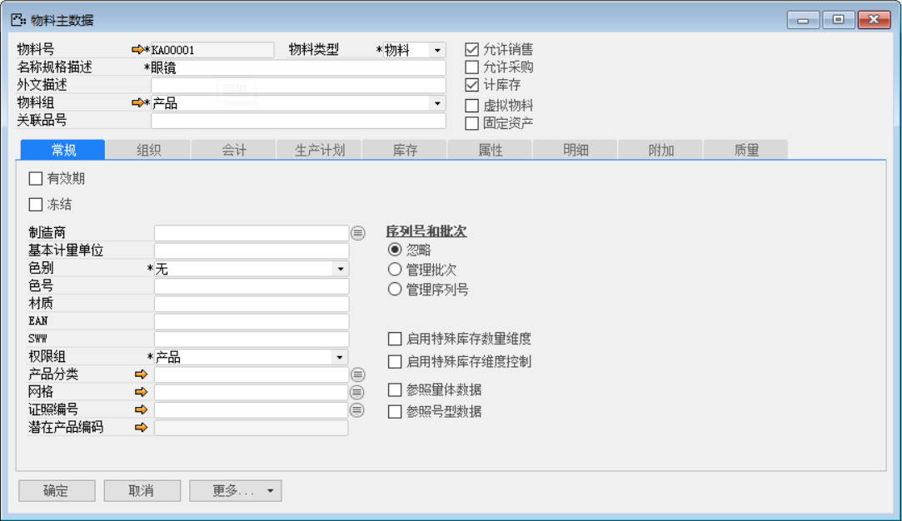

- 在【物料主数据】界面中点击【组织】选项卡在此选项卡下勾选隶属工厂并填写默认仓库和勾选MPS/MRP及直接MRP两个复选款，表明这个物料可以跑MRP和MPS，如以下图显示;

   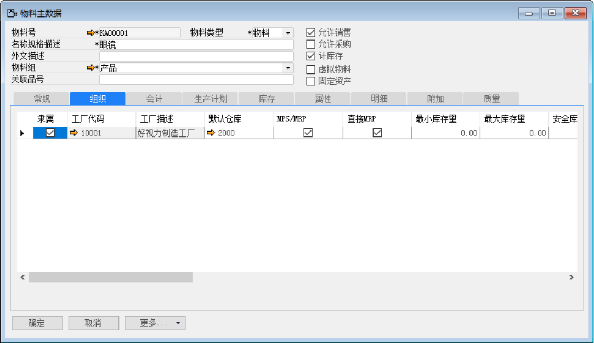

- 在【物料主数据】界面中点击【生产计划】选项卡填写生产计划相关内容，如以下图显示；

   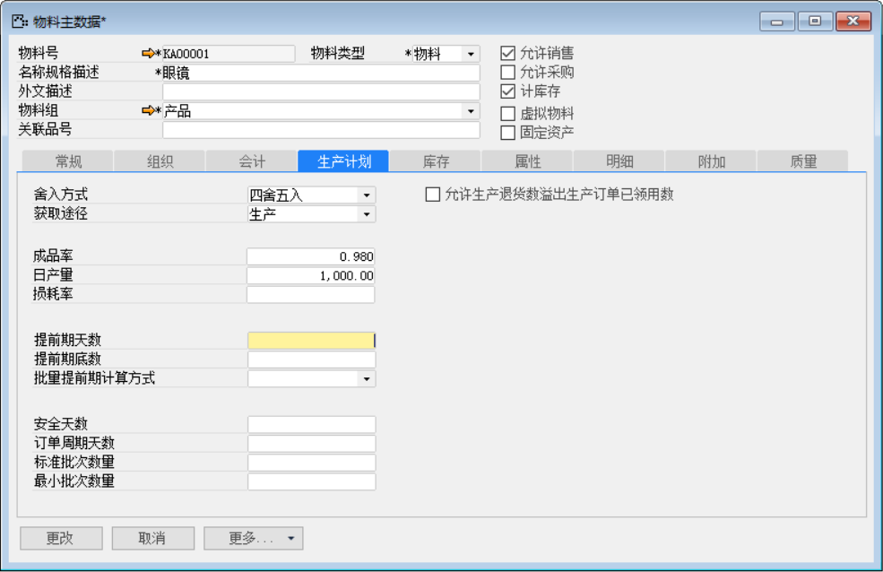

   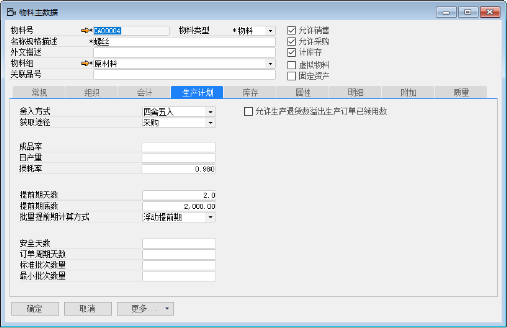

   物料-产成品需填写：

| **字段名称**       | **作用**                                                     | **用途**             |
| ------------------ | ------------------------------------------------------------ | -------------------- |
| 舍入方式           | 物料MRP计算后数量舍入方式                                    |                      |
| 获取途径           | MRP运算后产生的不同类型单据，如选择“生产”获取途径那么MRP运算产生生产订单（自制/委外）建议 |                      |
| 成品率             | 产出的合格率                                                 | 主要用于产品         |
| 日产量             | 每日生产出来的产品的数量                                     |                      |
| 损耗率             | 原材料在生产过程中损耗的一定比率                             | 主要用于原材料主数据 |
| 提前期天数         | MRP运算采购提前期天数                                        |                      |
| 提前期底数         | MRP运算提前期采购数量范围，若超出此数量提前期天数递增        |                      |
| 批量提前期计算方式 | 固定提前期：只按照设置的提前其天数来提前；浮动提前期：根据提前期底数，递增提前期天数 |                      |
| 安全天数           | 入库到可使用天数                                             | 主要用于采购方面     |
| 订单周期天数       | 采购天数                                                     |                      |
| 标准批次数量       | 采购标准批量，如：设置100个，那就按照100个递增               |                      |
| 最小批次数量       | 采购最小批量，如：小于100个，需求只要50个的时候              |                      |

   2、 创建完成产成品和原材料主数据后，打开【定义或更新物料清单】界面，创建物料清单（BOM）；

   打开路径：【计划】-【定义】-【定义或更新物料清单】

- 选择主物料与明细物料并输入明细物料数量等内容；
  
- 点击【保存】按钮并审批。

   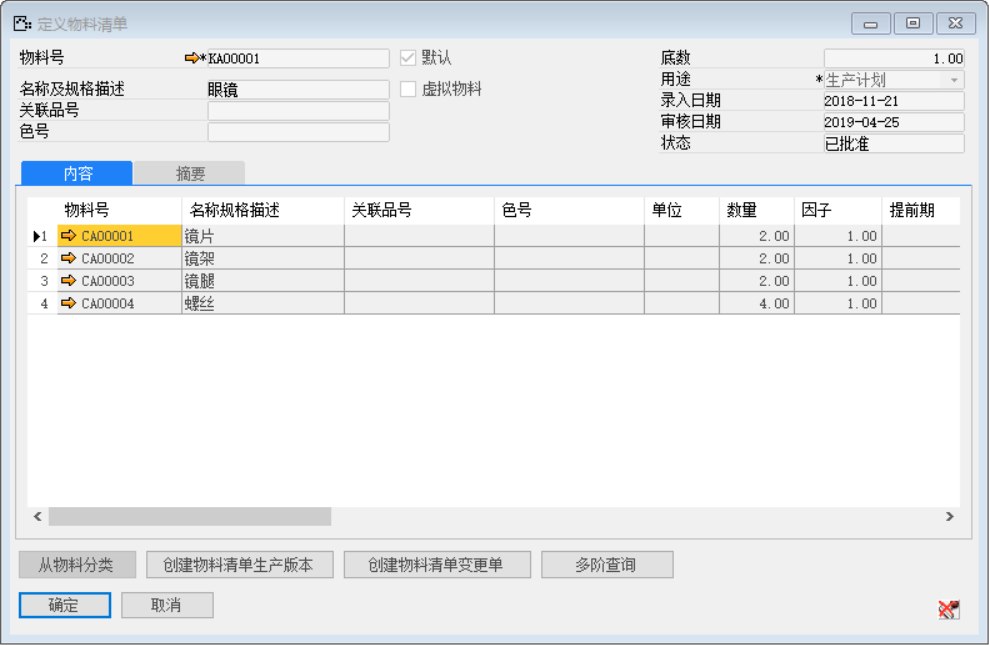

   二、 MRP界面解析

   打开【物料需求计划运算】界面点击下一步进入创建物料需求计划运算界面，如以下图所示。

   打开路径：【计划】-【物料需求计划运算】

- 讲解【物料需求计划运算】表头和【控制】选项卡下界面的字段作用

   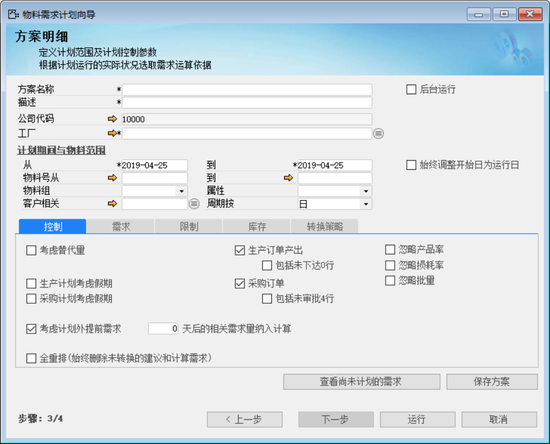

   **表头与控制选项卡下的字段**

| **字段名**                                       | **作用**                                                     |
| ------------------------------------------------ | ------------------------------------------------------------ |
| 方案名称                                         | MRP方案模板名称                                              |
| 描述                                             | MRP方案模板描述                                              |
| 公司代码                                         | MRP运行所属的公司                                            |
| 工厂                                             | MRP运行所属工厂                                              |
| 从.....到.....                                   | 销售订单交货日期间                                           |
| 物料号从.....到.....                             | 设置某个物料计算条件                                         |
| 物料组                                           | 设置某个物料组计算条件                                       |
| 属性                                             | 设置属性计算条件                                             |
| 客户相关                                         | 设置相关客户计算条件                                         |
| 周期按                                           | 选择计算后不同刻度的显示结果界面                             |
| 后台运算复选框                                   | 在后台中运算，结果要从查询MRP结果中查看                      |
| 始终调整开始日为运行日复选框                     | 始终把MRP时间条件自动按照当天为开始日偏移                    |
| 考虑替代量复选框                                 | 在MRP运行时考虑设置的替代关系                                |
| 生产计划考虑假期复选框                           | 在MRP运行时考虑生产计划工作假期                              |
| 采购计划考虑假期复选框                           | 在MRP运行时考虑采购计划工作假期                              |
| 考虑计划外提前需求复选框                         | 在MRP运行时考虑设置的计划外天数也一起计算                    |
| 全重排（始终删除未转换的问建议和计算需求）复选框 | 全重排法                                                     |
| 生产订单产出复选框                               | 在MRP运行时预计考虑产线上未入库的生产订单和未下达的生产订单未完成产出量 |
| 采购订单复选框                                   | 在MRP运行时考虑为审批的采购订单和在途的采购订单的未清预计收货量 |
| 忽略成品率复选框                                 | 在MRP运行时忽略物料主数据中设置的成品率                      |
| 忽略损耗率复选框                                 | 在MRP运行时忽略物料主数据中设置的损耗率                      |
| 忽略批量复选框                                   | 在MRP运行时忽略物料主数据中设置的批量                        |

   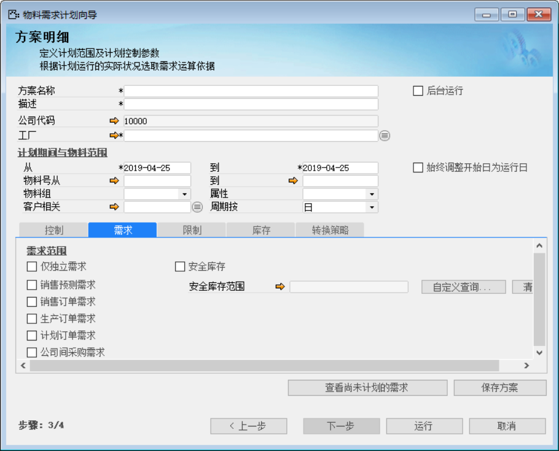

   **需求选项卡下的字段**

| **字段名称** | **作用**                                                     |
| ------------ | ------------------------------------------------------------ |
| 需求范围     | 勾选某种需要跑MRP运算的订单或其他需求                        |
| 安全库存     | MRP运算后的结果是否需要考虑最小库存量作用和当MRP运算没有需求范围那么只要满足安全库存条件就触发采购要求 |

   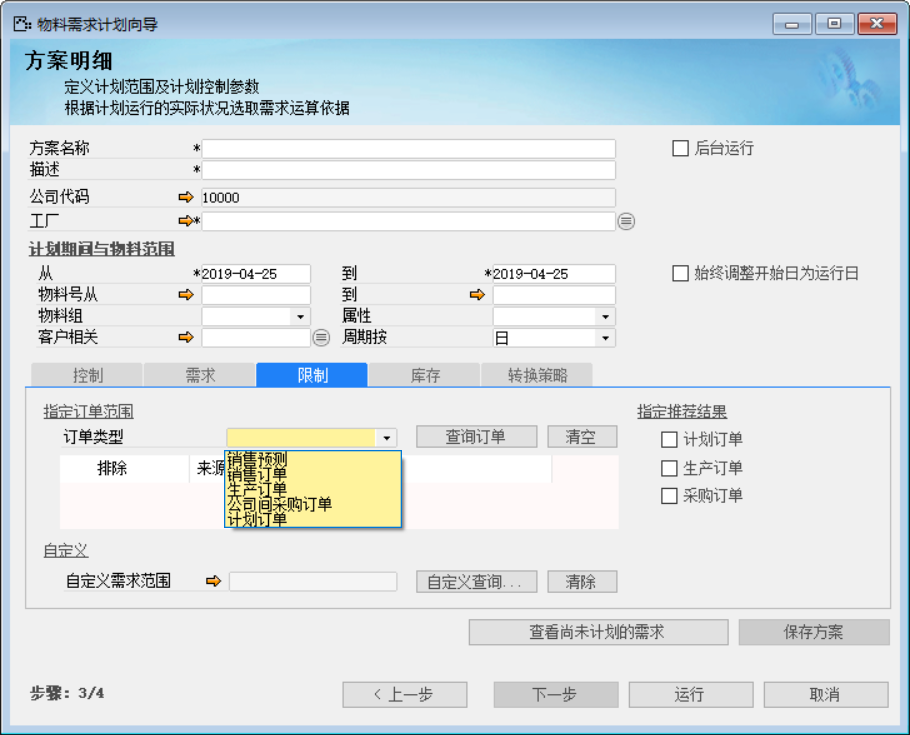

   **限制选项卡下的字段**

| **字段名称** | **作用**                                |
| ------------ | --------------------------------------- |
| 指定订单范围 | 指定某张或多张单据来作为需求运行MRP计算 |
| 自定义       | 自定义设置需求范围运行MRP计算           |
| 指定推荐结果 | 指定MRP运算计算出的结果                 |

   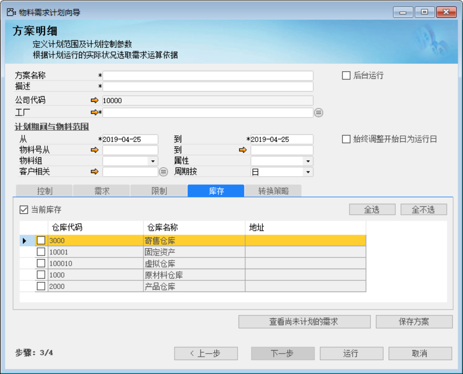

   **库存制选项卡下的字段**

| **字段名称** | **作用**                                |
| ------------ | --------------------------------------- |
| 当前库存     | 在MRP运算时考虑某个仓库中的当前库存计算 |

   

   **库存制选项卡下的字段**

| **字段名称**      | **作用**                                                     |
| ----------------- | ------------------------------------------------------------ |
| 订单转换策略      | 选择生产与采购建议的转换方式                                 |
| 库存/需求报表策略 | 选择是否需要MRP运算后出据日、周、月、毛需求、进需求、可用库存等字段的库存/需求报表 |

    

   三、 操作实例

   1、 打开【销售订单】界面，创建一张销售订单，做来跑MRP的需求；

   打开路径：【销售】-【订单】-【销售订单】

- 选择销售订单类型、客户、销售组织、销售组和创建好的产品物料等信息内容；
  
- 点击【保存】按钮并审批。

   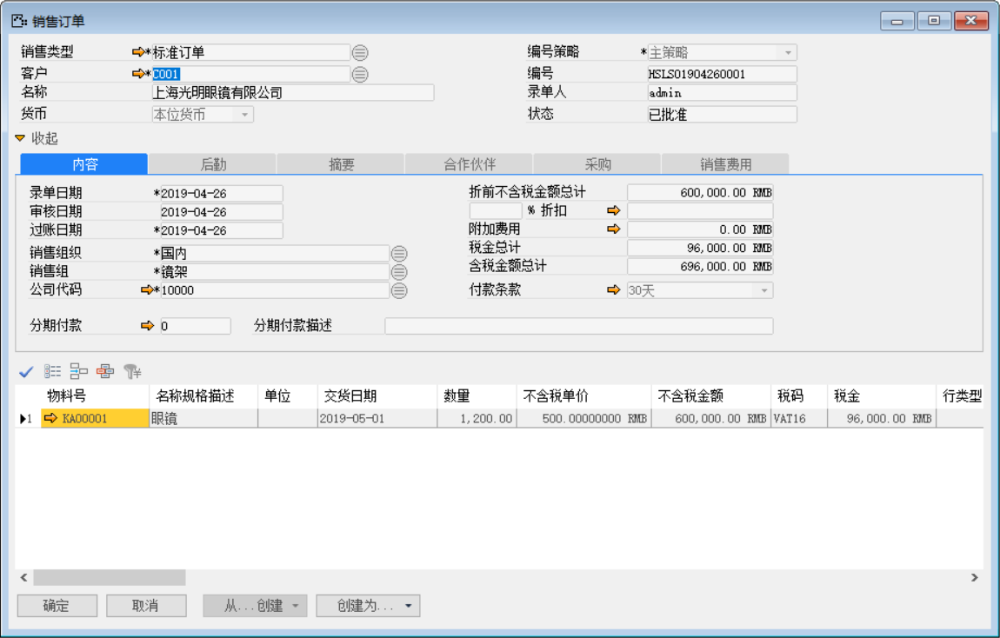

   2、 打开【物料需求运算】界面，创建物料需求运算方案并运算；

   打开路径：【计划】-【物料需求运算】

- 选择需运行的公司代码，点击下一步创建新方案；

   

- 填写物料需求计划方案信息及选择运算范围、运算控制条件等内容；

   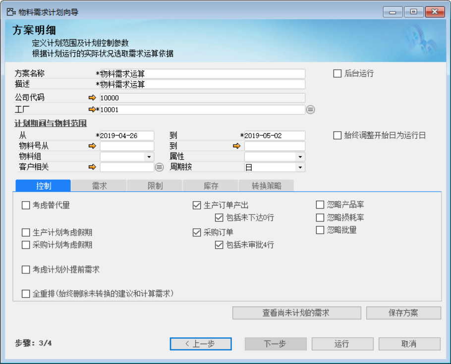

- 点击【物料需求运算】界面中【运行】按钮进行MRP计算，进入运算后结果界面并保存方案及结果。

   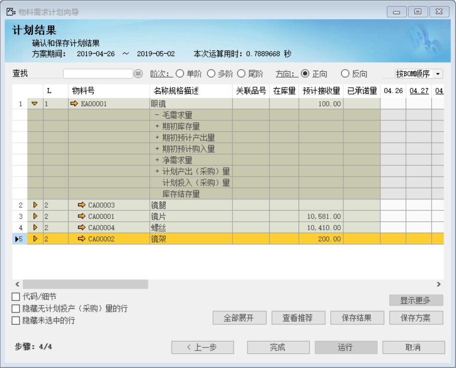

   3、 打开【生产或采购建议】界面，转换MRP运算后保存的生产与采购建议结果为生产订单和采购订单。

   打开路径：【计划】-【生产或采购建议】

- 填写查询生产和采购建议条件；

   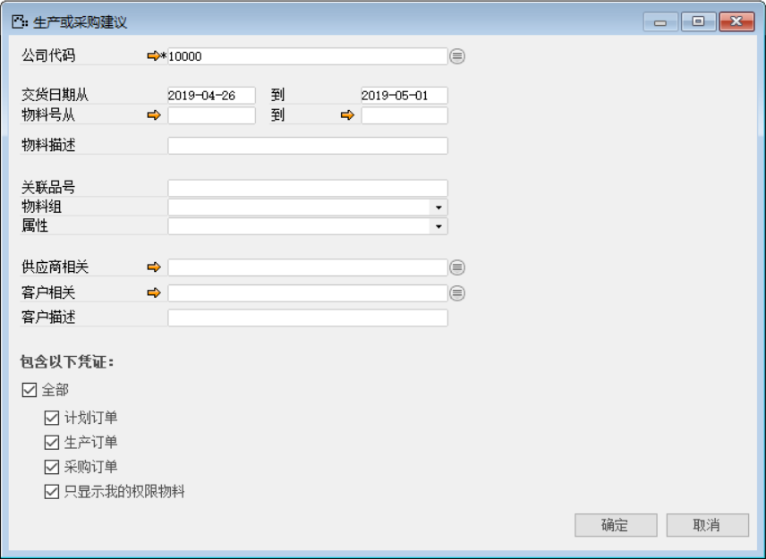

- 选择需要转换的采购建议，点击【转换】按钮，选择采购建议转换为订单或申请和采购组织及采购组；

   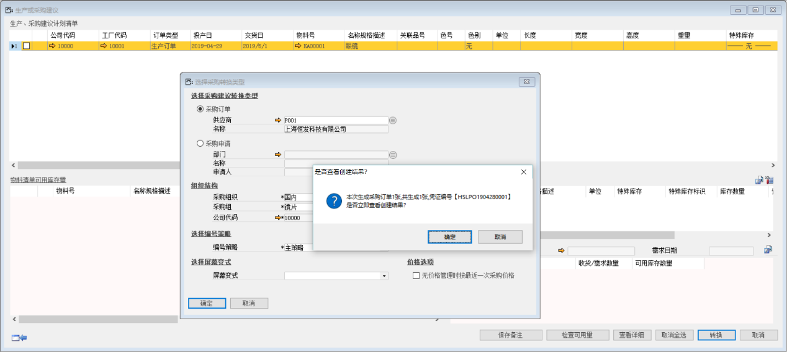

   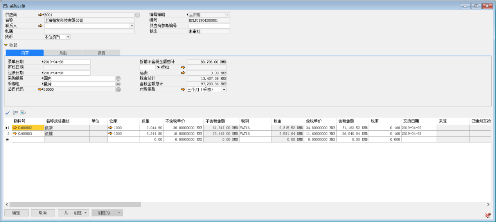

- 选择需要转换的生产建议，点击【转换】按钮，选择生产建议转换为自制或委外订单。

   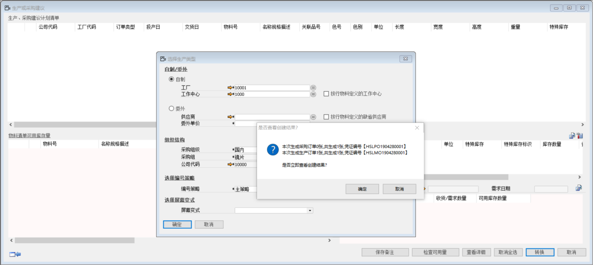

   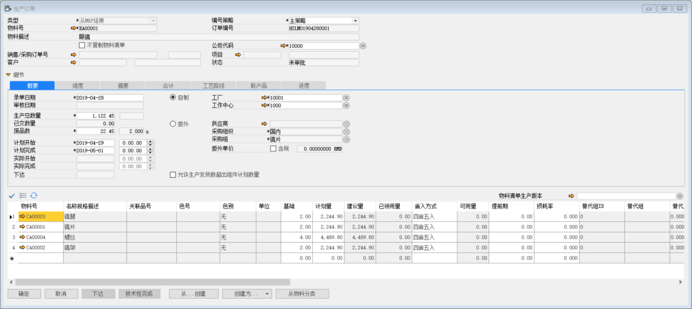